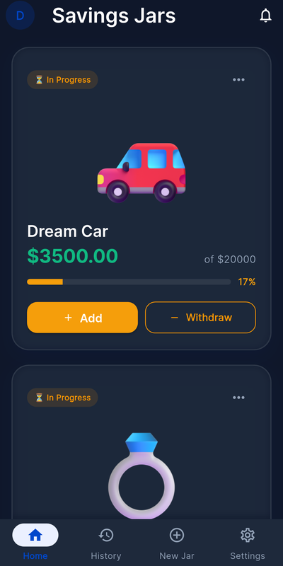
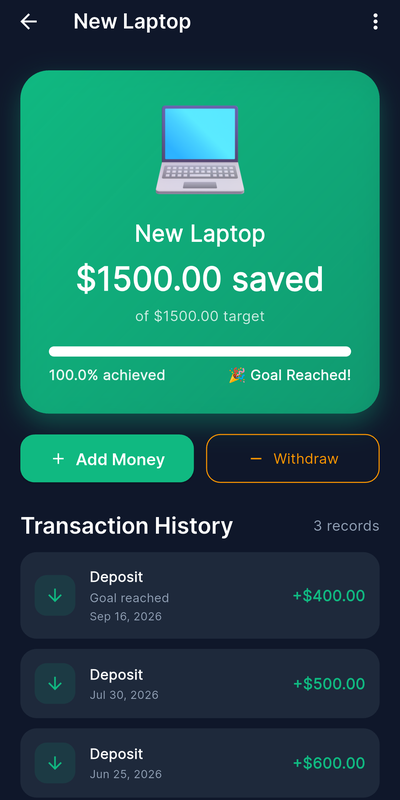
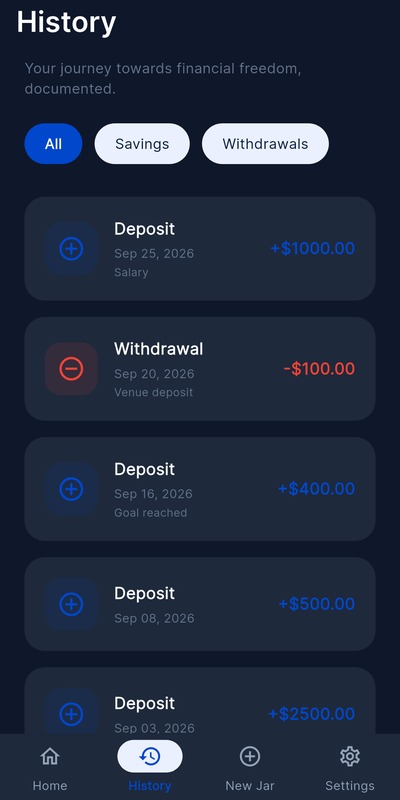
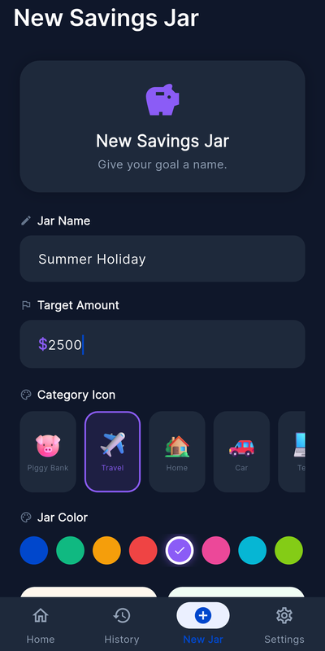
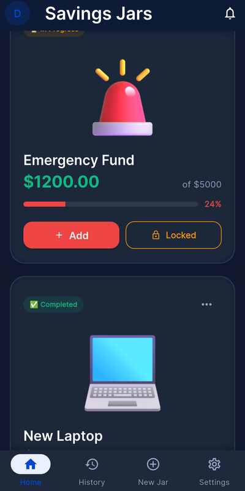
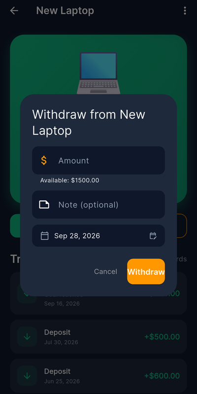
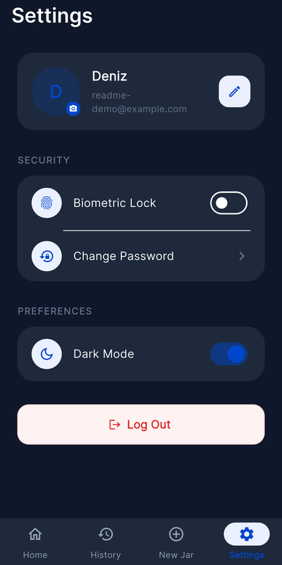
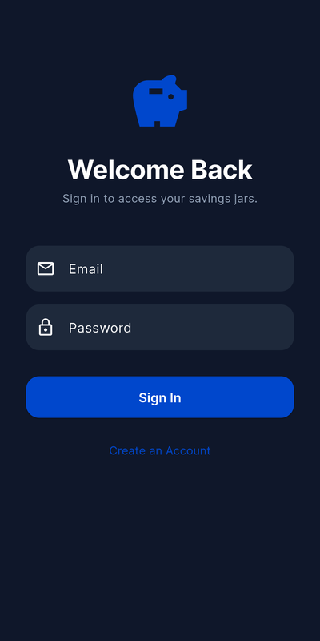

<p align="center">
  
</p>

<h1 align="center">Savings Jar 🏺</h1>

<p align="center">
  Hedeflerin için sanal birikim kavanozları oluştur, para ekle, ilerlemeni takip et.<br/>
  Flutter + Firebase ile geliştirilmiş kişisel birikim uygulaması.
</p>

<p align="center">
  
  &nbsp;
  
  &nbsp;
  
</p>

---

## ✨ Özellikler

### 🏺 Birikim kavanozları
Her hedef için ayrı bir kavanoz oluştur: bir isim ve hedef tutar gir, 18 kategoriden birini ve bir renk seç. Ana sayfada her kavanozun biriken tutarı, hedefi ve yüzde kaçının tamamlandığı görünür. Hedefe ulaşan kavanozlar **Completed** olarak işaretlenir.

<p align="center">
  
  &nbsp;
  
</p>

Kavanoz oluştururken iki seçenek var:

- **🔒 Locked Jar:** Hedefe ulaşılana kadar kavanozdan para çekilemez; buton **Locked** olarak görünür. Bu kural sunucu tarafında da uygulanır.
- **✨ Auto-Save:** Yatırılan her tutar bir üst tam sayıya yuvarlanır (örneğin 12,30 $ → 13 $).

### 💸 Para ekleme ve çekme
Her işleme not ve tarih eklenebilir. Bakiyeden fazla para çekilemez; pencere kullanılabilir tutarı gösterir. Hedefi tamamlayan yatırımda konfetili bir kutlama ekranı açılır 🎉.

<p align="center">
  
</p>

### 📜 İşlem geçmişi
Bütün yatırma ve çekme işlemleri tarih sırasıyla listelenir; **All / Savings / Withdrawals** filtreleriyle ayrılabilir. Her kavanozun detay ekranında da o kavanoza ait işlemler görünür.

### ⚙️ Ayarlar ve güvenlik
<p align="center">
  
  &nbsp;
  
</p>

- **E-posta ve şifreyle giriş / kayıt** (Firebase Authentication)
- **Biyometrik kilit:** Açıkken uygulama her açılışta parmak izi, yüz tanıma veya cihaz şifresi ister.
- **Karanlık mod:** Tercih uygulama kapansa da hatırlanır.
- **Profil:** Görünen ad ve profil fotoğrafı değiştirilebilir.
- **Gerçek zamanlı senkronizasyon:** Veriler Firestore'da tutulur, her cihazda anında güncellenir. Çevrimdışıyken de okunabilir.

---

## 🛠️ Teknolojiler

| Alan | Kullanılan |
|---|---|
| Arayüz | Flutter (Material 3), Google Fonts (Inter) |
| Durum yönetimi | Provider (`JarProvider`, `ThemeProvider`, `SecurityProvider`) |
| Backend | Firebase Auth, Cloud Firestore, Firebase Storage |
| Cihaz | `local_auth` (biyometri), `shared_preferences`, `image_picker` |
| Diğer | `intl`, `confetti` |

## 📁 Proje yapısı

```
lib/
├── core/            # Tema, kategori ikonları, para kuralları (money_rules.dart)
├── data/models/     # JarModel, TransactionModel
├── providers/       # JarProvider, ThemeProvider, SecurityProvider
├── ui/
│   ├── screens/     # Giriş, ana sayfa, detay, geçmiş, yeni kavanoz, ayarlar, kutlama
│   └── widgets/     # Ortak para ekleme/çekme ve silme işlemleri
└── images/          # Kategori görselleri
firestore.rules      # Firestore güvenlik kuralları
storage.rules        # Storage güvenlik kuralları
tool/make_icon.py    # Uygulama ikonunu çizen script
```

## 🚀 Kurulum

1. Flutter SDK'yı kur (Dart `^3.9.2`).
2. Firebase yapılandırmasını ekle: `android/app/google-services.json` ve `lib/firebase_options.dart` (`flutterfire configure` ile üretilebilir).
3. Bağımlılıkları yükle ve çalıştır:
   ```bash
   flutter pub get
   flutter run
   ```
4. Güvenlik kurallarını yayınla:
   ```bash
   firebase deploy --only firestore:rules,storage
   ```
   Profil fotoğrafı yükleme için Firebase konsolundan **Storage**'ın etkinleştirilmiş olması gerekir.

### Testler

```bash
flutter test
```

Para kuralları (tutar doğrulama, kilit, Auto-Save, hedef) ve kategori görselleri için testler bulunur.

### İkonu yeniden üretmek

```bash
python tool/make_icon.py assets/icon
dart run flutter_launcher_icons
```

## 📄 Lisanslar

Kategori görselleri Microsoft [Fluent Emoji](https://github.com/microsoft/fluentui-emoji) setinden alınmıştır ve MIT lisanslıdır ([lisans metni](lib/images/LICENSE-fluentui-emoji.txt)).
