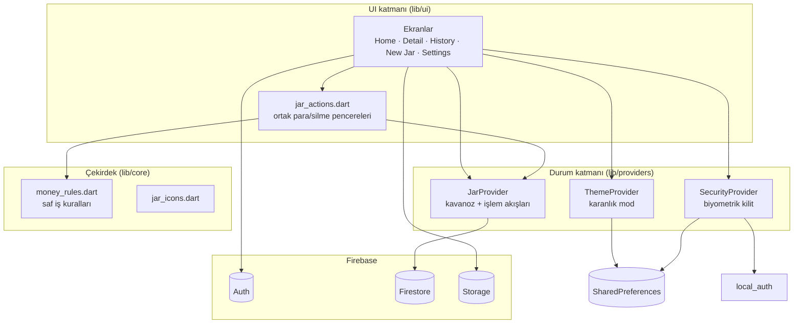
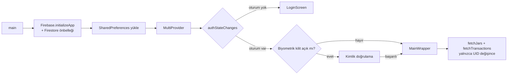

<p align="center">
  
</p>

<h1 align="center">Savings Jar</h1>

<p align="center">
  Hedef odaklı birikim uygulaması: her hedef için sanal bir "kavanoz" oluştur, para ekle, ilerlemeni gerçek zamanlı takip et.
</p>

<p align="center">
  
  
  
  
</p>

---

## İçindekiler

- [Genel bakış](#genel-bakış)
- [Ekran görüntüleri](#ekran-görüntüleri)
- [Özellikler](#özellikler)
- [Mimari](#mimari)
- [Veri modeli](#veri-modeli)
- [Veri akışı](#veri-akışı)
- [İş kuralları](#i̇ş-kuralları)
- [Güvenlik](#güvenlik)
- [Proje yapısı](#proje-yapısı)
- [Teknoloji yığını](#teknoloji-yığını)
- [Platform yapılandırması](#platform-yapılandırması)
- [Kurulum ve çalıştırma](#kurulum-ve-çalıştırma)
- [Testler](#testler)
- [Bilinen sınırlamalar ve yol haritası](#bilinen-sınırlamalar-ve-yol-haritası)
- [Lisanslar](#lisanslar)

## Genel bakış

Savings Jar, birikim hedeflerini birbirinden ayrı "kavanozlar" olarak yöneten bir Flutter mobil uygulamasıdır. Kullanıcı bir hedef tutar belirler (ör. *Japonya tatili – 3.000 $*), zaman içinde para ekler veya çeker; uygulama ilerlemeyi yüzde olarak gösterir ve hedefe ulaşıldığında kutlama ekranı açar.

Veriler **Cloud Firestore**'da kullanıcıya özel tutulur ve anlık dinleyicilerle (real-time listeners) bütün cihazlarda senkronize edilir. Kimlik doğrulama **Firebase Authentication** (e-posta/şifre) ile yapılır. Veri güvenliği yalnızca istemciye bırakılmaz: kilit ve bakiye kuralları **Firestore Security Rules** ile sunucu tarafında da uygulanır.

## Ekran görüntüleri

| Ana sayfa | Kilitli / tamamlanmış | Kavanoz detayı | Para çekme |
|:---:|:---:|:---:|:---:|
|  |  |  |  |
| **İşlem geçmişi** | **Yeni kavanoz** | **Ayarlar** | **Giriş** |
|  |  |  |  |

## Özellikler

**Kavanoz yönetimi**
- İsim, hedef tutar, 18 kategori (her biri için 3D görsel) ve 10 renk seçeneğiyle kavanoz oluşturma
- Kavanoz başına biriken tutar, hedef, ilerleme çubuğu ve *In Progress / Completed* durumu
- Onaylı silme: kavanoz, ona ait bütün işlemlerle birlikte silinir

**Para hareketleri**
- Not ve geçmişe dönük tarih eklenebilen para yatırma / çekme işlemleri
- Bakiyeden fazla çekim engellenir; pencere kullanılabilir tutarı gösterir
- Hedefi tamamlayan yatırımda konfetili kutlama ekranı (hedef zaten tamamlanmışsa tekrar açılmaz)

**Kavanoz seçenekleri**
- **Locked Jar:** Hedefe ulaşılana kadar para çekilemez
- **Auto-Save:** Her yatırım bir üst tam sayıya yuvarlanır (12,30 $ → 13 $); işlem *Deposit (rounded up)* olarak kaydedilir

**Geçmiş**
- Bütün işlemlerin tarih sıralı listesi, *All / Savings / Withdrawals* filtreleri
- Her kavanozun detay ekranında kendi işlem geçmişi

**Hesap ve ayarlar**
- E-posta/şifre ile kayıt ve giriş
- Görünen ad ve profil fotoğrafı (Firebase Storage)
- Biyometrik kilit (parmak izi / yüz tanıma, cihaz şifresi yedeğiyle)
- Kalıcı karanlık mod
- Çevrimdışı okuma (Firestore yerel önbelleği)

## Mimari

Uygulama katmanlı bir yapıdadır. Arayüz, durumu **Provider** üzerinden okur. Provider'lar Firebase SDK'larıyla konuşur. Saf iş kuralları (`money_rules.dart`) hiçbir Flutter veya Firebase bağımlılığı taşımaz, bu yüzden doğrudan birim testiyle doğrulanır.



### Uygulama açılışı



- `_AuthGate`, `FirebaseAuth.authStateChanges()` akışını dinler ve dinleyicileri yalnızca **kullanıcı kimliği (UID) değiştiğinde** yeniden kurar. Böylece yeniden çizimler gereksiz Firestore aboneliği açmaz.
- `SavingsJarApp`, `Selector<ThemeProvider, ThemeMode>` kullanır. `MaterialApp` yalnızca tema değişince yeniden oluşturulur.
- Alt sekmeler `PageView` + `NeverScrollableScrollPhysics` ile gösterilir. Kaydırma kapalıdır, geçiş yalnızca alt menüden yapılır. Yeni kavanoz oluşturulunca `onJarCreated` geri çağrısı ana sayfaya döner.

## Veri modeli

Firestore'da üç koleksiyon vardır. Her belge sahibini `userId` alanıyla taşır ve bütün sorgular bu alana göre filtrelenir.

### `jars`

| Alan | Tip | Açıklama |
|---|---|---|
| `name` | string | Kavanoz adı |
| `targetAmount` | number | Hedef tutar |
| `savedAmount` | number | Biriken tutar. Yalnızca `FieldValue.increment` ile değişir |
| `iconStyle` | string | Kategori anahtarı (`piggy`, `plane`, `home`, …) |
| `color` | int | ARGB renk değeri |
| `locked` | bool | Hedefe kadar çekim yasağı |
| `autoSave` | bool | Yatırımları yukarı yuvarlama |
| `createdAt` | string (ISO-8601) | Oluşturulma zamanı |
| `userId` | string | Sahibin UID'si |

### `transactions`

| Alan | Tip | Açıklama |
|---|---|---|
| `jarId` | string | Bağlı kavanoz |
| `title` | string | `Deposit`, `Withdrawal` veya `Deposit (rounded up)` |
| `amount` | number | Pozitif = yatırma, negatif = çekme |
| `note` | string \| null | İsteğe bağlı not |
| `createdAt` | timestamp | İşlem tarihi (geçmişe dönük seçilebilir) |
| `userId` | string | Sahibin UID'si |

### `users/{uid}`

| Alan | Tip | Açıklama |
|---|---|---|
| `displayName` | string | Görünen ad |
| `photoURL` | string | Profil fotoğrafı (`profile_photos/{uid}.jpg`) |

Modellerin `fromMap` metotları toleranslıdır: sayıların string olarak kaydedilmesi, tarihin `Timestamp`, `DateTime` veya ISO string olması gibi durumları güvenle çözümler.

## Veri akışı

**Gerçek zamanlı okuma.** `JarProvider`, kullanıcının `jars` ve `transactions` koleksiyonlarına `snapshots()` ile abone olur. Her değişiklikte liste istemcide tarihe göre sıralanır ve `notifyListeners()` çağrılır. Sunucu tarafında `orderBy` kullanılmamasının sebebi, `where(userId) + orderBy(createdAt)` birleşiminin ayrı bir bileşik indeks gerektirmesidir. Ekranlar `Selector` ile yalnızca ilgili liste değişince yeniden çizilir. Kavanoz detayındaki işlemler ek bir abonelik açılmadan bellekteki listeden süzülür (`transactionsForJar`).

**Atomik para hareketi.** Para ekleme veya çekme tek bir `WriteBatch` ile yapılır:

```dart
batch.update(jarRef, {'savedAmount': FieldValue.increment(amount)});
batch.set(txRef, { 'jarId': ..., 'amount': amount, 'userId': uid, ... });
await batch.commit();   // ya ikisi birden yazılır ya hiçbiri
```

`FieldValue.increment` sayesinde aynı anda iki cihazdan yapılan işlemler birbirinin üzerine yazmaz.

**Silme.** Kavanoz silinirken önce ona ait işlemler, en son kavanozun kendisi silinir. Firestore'un batch başına 500 yazma sınırı nedeniyle işlem 500'lük parçalara bölünür. Kavanozun en son silinmesi, yarıda kalan bir silme işleminde sahipsiz işlem kaydı oluşmasını önler.

**Çevrimdışı.** Firestore kalıcı önbelleği sınırsız boyutla açıktır (`persistenceEnabled`, `CACHE_SIZE_UNLIMITED`). Uygulama bağlantı yokken son bilinen veriyi gösterir.

## İş kuralları

Para ile ilgili bütün kurallar `lib/core/money_rules.dart` dosyasında saf fonksiyonlar olarak tanımlıdır:

| Fonksiyon | Kural |
|---|---|
| `parseAmount` | `12,5` ve `12.5` yazımlarını kabul eder, tutarı **kuruşa yuvarlar**, geçersiz girdide `null` döner |
| `validateAmount` | Tutar > 0 olmalı. Çekimde bakiye aşılamaz. Karşılaştırma kuruş cinsinden yapılır, böylece `0.1 + 0.2` gibi kayan nokta hataları sonucu etkilemez |
| `canWithdraw` | Kilitli kavanozdan yalnızca hedefe ulaşıldıktan sonra para çekilebilir |
| `applyAutoSave` | Auto-Save açıksa tutar bir üst tam sayıya yuvarlanır |
| `reachesGoal` | Yalnızca kavanozu hedefe **ilk kez** ulaştıran yatırım `true` döner (kutlama tetikleyicisi) |

Kilit ve bakiye kuralları ayrıca Firestore kurallarında da tekrarlanır. Değiştirilmiş bir istemci bile bu kuralları aşamaz.

## Güvenlik

### Firestore kuralları ([`firestore.rules`](firestore.rules))

- **Sahiplik:** Her belge yalnızca `userId == request.auth.uid` olan kullanıcı tarafından okunabilir, oluşturulabilir veya silinebilir. `users/{uid}` belgesine yalnızca sahibi erişir.
- **Kavanoz oluşturma:** `savedAmount` sıfırdan başlamak zorundadır. Bakiye yalnızca işlemlerle artar.
- **Kavanoz güncelleme:**
  - Bakiye negatife düşemez (`savedAmount >= -0.01`, kayan nokta hataları için küçük tolerans)
  - Kilitli ve hedefi tamamlanmamış kavanozda bakiye azaltılamaz
  - `userId` başka bir kullanıcıya devredilemez
- **İşlemler:** Yalnızca kullanıcının kendi kavanozuna işlem eklenebilir (`get()` ile kavanozun sahibi kontrol edilir). Oluşturulan işlemler değiştirilemez (`update: false`).

### Storage kuralları ([`storage.rules`](storage.rules))

Kullanıcı yalnızca `profile_photos/{kendi uid}.jpg` dosyasını yazabilir. Dosya 5 MB'tan küçük ve `image/*` türünde olmalıdır.

### Biyometrik kilit

- `local_auth` ile parmak izi veya yüz tanıma istenir. Cihaz şifresi yedek yöntem olarak kabul edilir.
- Kilidi açmak için önce başarılı bir doğrulama gerekir. Bu, doğrulama yapamayan bir cihazda kullanıcının uygulamanın dışında kalmasını önler.
- Kilit, uygulama sıfırdan açıldığında devreye girer.

> **Not:** `lib/firebase_options.dart` içindeki API anahtarları gizli bilgi değildir. Firebase istemci anahtarları tasarım gereği uygulamaya gömülüdür. Asıl güvenlik yukarıdaki kurallarla sağlanır.

## Proje yapısı

```
lib/
├── main.dart                      # Başlatma, provider'lar, _AuthGate, lisans kaydı
├── firebase_options.dart          # FlutterFire yapılandırması
├── core/
│   ├── theme.dart                 # Açık/koyu tema, renk paleti (Inter fontu)
│   ├── money_rules.dart           # Saf para kuralları (test edilir)
│   └── jar_icons.dart             # Kategori → ikon/görsel eşlemesi
├── data/models/
│   ├── jar_model.dart
│   └── transaction_model.dart
├── providers/
│   ├── jar_provider.dart          # Firestore akışları, batch yazma, silme
│   ├── theme_provider.dart        # Kalıcı karanlık mod
│   └── security_provider.dart     # Kalıcı biyometrik ayar + local_auth
├── ui/
│   ├── screens/
│   │   ├── login_screen.dart
│   │   ├── biometric_gate.dart    # Kilit ekranı
│   │   ├── main_wrapper.dart      # Alt sekme gezinmesi
│   │   ├── home_screen.dart
│   │   ├── jar_detail_screen.dart
│   │   ├── history_screen.dart
│   │   ├── create_jar_screen.dart
│   │   ├── settings_screen.dart
│   │   └── celebration_screen.dart
│   └── widgets/
│       └── jar_actions.dart       # Para ekleme/çekme penceresi, onaylı silme
└── images/                        # 18 kategori görseli + lisans
test/
├── money_rules_test.dart          # İş kuralları
└── widget_test.dart               # Kategori görselleri
assets/icon/                       # Uygulama ikonu kaynakları
tool/make_icon.py                  # İkonu çizen script
docs/screenshots/                  # README görselleri
firestore.rules · storage.rules    # Firebase güvenlik kuralları
```

## Teknoloji yığını

| Paket | Sürüm | Kullanım amacı |
|---|---|---|
| `firebase_core` | 2.32.0 | Firebase başlatma |
| `firebase_auth` | 4.16.0 | E-posta/şifre kimlik doğrulama |
| `cloud_firestore` | 4.17.5 | Gerçek zamanlı veritabanı, çevrimdışı önbellek |
| `firebase_storage` | 11.6.5 | Profil fotoğrafları |
| `provider` | 6.1.5 | Durum yönetimi |
| `local_auth` | 2.3.0 | Biyometrik kimlik doğrulama |
| `shared_preferences` | 2.5.5 | Tema ve güvenlik tercihleri |
| `image_picker` | 1.2.2 | Galeriden fotoğraf seçme |
| `google_fonts` | 6.3.3 | Inter yazı tipi |
| `intl` | 0.19.0 | Tarih biçimlendirme |
| `confetti` | 0.7.0 | Kutlama animasyonu |
| `flutter_launcher_icons` | 0.14.4 | İkon üretimi (geliştirme) |

## Platform yapılandırması

**Android**
- `applicationId`: `com.example.savings`
- `MainActivity`, `FlutterFragmentActivity`'den türetilir. `local_auth` biyometrik pencereyi göstermek için bunu gerektirir.
- İzin: `USE_BIOMETRIC`
- Build araçları: Gradle 8.14, Android Gradle Plugin 8.11.1, Kotlin 2.2.20
- Uyarlanabilir ikon (Android 8+)

**iOS**
- Minimum sürüm: iOS 13.0
- `Info.plist` açıklamaları: `NSFaceIDUsageDescription` (Face ID), `NSPhotoLibraryUsageDescription` (profil fotoğrafı)

## Kurulum ve çalıştırma

### Gereksinimler

- Flutter **3.47** (stable) ve Dart **^3.9.2**
- Android SDK (Android için) veya Xcode (iOS için, yalnızca macOS)
- [Firebase CLI](https://firebase.google.com/docs/cli) (kuralları yayınlamak için)

### Adımlar

```bash
# 1. Bağımlılıklar
flutter pub get

# 2. Firebase yapılandırması (kendi projen için)
dart pub global activate flutterfire_cli
flutterfire configure        # firebase_options.dart ve google-services.json üretir

# 3. Güvenlik kuralları
firebase deploy --only firestore:rules,storage

# 4. Çalıştır
flutter run
```

Firebase konsolunda şunlar etkin olmalıdır:
- **Authentication → Email/Password** oturum açma yöntemi
- **Firestore**
- **Storage** (profil fotoğrafı için)

### Release APK

```bash
flutter build apk --release
flutter install --release
```

## Testler

```bash
flutter test
```

| Dosya | Kapsam |
|---|---|
| `test/money_rules_test.dart` | Tutar ayrıştırma ve kuruş yuvarlama, bakiye doğrulama (kayan nokta toleransı dahil), kilit kuralı, Auto-Save, hedef tetikleyicisi |
| `test/widget_test.dart` | 18 kategori görselinin pakete dahil edilmesi ve doğru çizilmesi, bilinmeyen kategori için yedek ikon |

Analiz için: `flutter analyze`

## Bilinen sınırlamalar ve yol haritası

- [ ] **Bildirimler:** Ana sayfadaki zil butonu henüz bir işlev taşımıyor
- [ ] **Şifre değiştirme:** Ayarlarda "yakında" olarak işaretli
- [ ] **Para birimi:** Sabit olarak `$`; yerelleştirme ve para birimi seçimi yok
- [ ] **Dil:** Arayüz yalnızca İngilizce
- [ ] **Sayfalama:** Bütün işlemler tek seferde yüklenir. Çok sayıda işlem için sayfalı sorgu ve bileşik indeks eklenmeli
- [ ] **Biyometrik kilit** yalnızca soğuk açılışta devreye giriyor; arka plandan dönüşte de sorulabilir
- [ ] **Sekme durumu:** Görünmeyen sekmeler bellekten atılıyor; ör. yarım doldurulmuş Yeni Kavanoz formu sekme değişince sıfırlanıyor
- [ ] **Bağımlılıklar:** Firebase paketleri eski ana sürümlerde (ör. `cloud_firestore` 4.x). Güncel sürümlere geçiş planlanmalı
- [ ] **Yayın hazırlığı:**
  - `applicationId` `com.example` ön ekinden değiştirilmeli
  - Release build'i şu an debug anahtarıyla imzalanıyor, kendi imzalama anahtarı eklenmeli

## Lisanslar

Kategori görselleri Microsoft [Fluent Emoji](https://github.com/microsoft/fluentui-emoji) setinden alınmıştır ve MIT lisanslıdır ([lisans metni](lib/images/LICENSE-fluentui-emoji.txt)). Lisans metni uygulama içindeki lisans sayfasına da kaydedilir.
